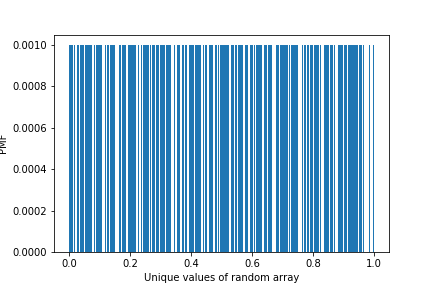

[Think Stats Chapter 4 Exercise 2](http://greenteapress.com/thinkstats2/html/thinkstats2005.html#toc41) (a random distribution)

>> For this problem, we are asked to plot the PMF and CDF of a random uniform distribution of 1000 numbers between 0 and 1 generated by `np.random.random`, to assess whether they truly are random. To do this, I first found the PMF output for each value by using `np.unique`, storing the counts, and calculating the fraction of counts belonging to each value. The code and PMF bar plot for this are shown below:

```python
rand = np.random.random(1000)
from matplotlib import pyplot as plt
val, cnt = np.unique(rand, return_counts = True)
prob = cnt / sum(cnt)
plt.bar(val, prob, width = 0.001)
plt.xlabel('Unique values of random array')
plt.ylabel('PMF')
plt.savefig('barplot3.png')
```



> > This plot is not a good way to answer the question since every value in the array is unique (which is likely to occur given the precision of the random number generator), and so the count of each value is 1 with probability 1/1000. To generate the CDF, I sorted the values, found the percent rank of each value by calculating the fraction of values less than or equal to that value, and plotted the percent ranks as a step function against the sorted values:

```python
perc_rank = []
rand.sort()
for x in rand:
    perc_rank += [len(rand[rand <= x]) / len(rand)]
plt.step(rand, perc_rank)
plt.xlabel('Values of random array')
plt.ylabel('CDF')
plt.savefig('stepplot.png')
```


This plot suggests the random number generator truly is random, since the values clearly follow a uniform distribution as indicated by the straight line CDF. The plot would have curvature if some values were more likely than others. 
